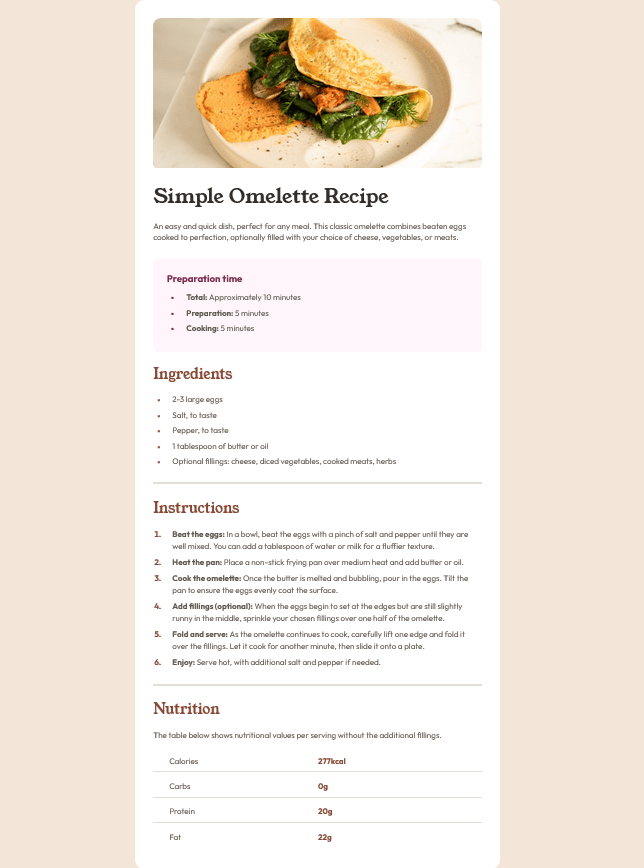

# Frontend Mentor - Recipe page solution

This is a solution to the [Recipe page challenge on Frontend Mentor](https://www.frontendmentor.io/challenges/recipe-page-KiTsR8QQKm). 

### Screenshot

### Links

- Solution URL: [Click Here](https://your-solution-url.com)

### Built with

- Semantic HTML5 markup
- CSS custom properties
- Flexbox

### Useful resources

- [Cloudconvert](https://cloudconvert.com) - This helped me for converting my fonts from ttf to woff.